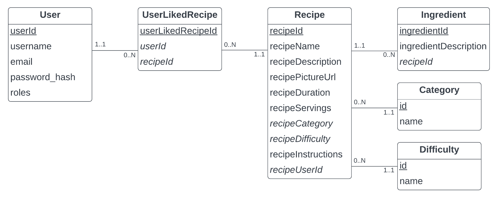

# Indra Van Wynendaele (202289380)

- [x] Front-end Web Development
  - <https://github.com/Web-IV/2324-frontendweb-IndraVanWynendaele>
  - <https://two324-frontendweb-indravanwynendaele.onrender.com>
- [x] Web Services:
  - <https://github.com/Web-IV/2324-webservices-IndraVanWynendaele>
  - <https://two324-webservices-indravanwynendaele.onrender.com>

**Logingegevens Admin**

- e-mailadres: indra.vanwynendaele@gmail.com
- Wachtwoord: 12345678

## Projectbeschrijving

Mijn project is een verzamelplaats voor recepten. Gebruikers die niet ingelogd zijn, kunnen alle recepten en hun details bekijken. Ingelogde gebruikers kunnen nieuwe recepten uploaden en kunnen ook bestaande recepten van andere gebruikers liken. Hun eigen recepten kunnen ze natuurlijk ook bewerken en verwijderen.

## Screenshots

De home pagina van de website:

De pagina met verzameling van alle recepten van alle gebruikers:

Wanneer je een recept wilt liken en niet ingelogd bent:

De volledige beschrijving van een recept:

Login form:

Register form:

Je eigen gelikete en gemaakte recepten:

Je eigen gelikete en gemaakte recepten:

Recept bewerken:

Ingrediënten bij een recept bewerken:

## API calls

<http://localhost:9000/swagger>

## Behaalde minimumvereisten

### Front-end Web Development

- **componenten**

  - [x] heeft meerdere componenten - dom & slim (naast login/register)
  - [x] applicatie is voldoende complex
  - [x] definieert constanten (variabelen, functies en componenten) buiten de component
  - [x] minstens één form met meerdere velden met validatie (naast login/register)
  - [x] login systeem
         

- **routing**

  - [x] heeft minstens 2 pagina's (naast login/register)
  - [x] routes worden afgeschermd met authenticatie en autorisatie
         

- **state-management**

  - [x] meerdere API calls (naast login/register)
  - [x] degelijke foutmeldingen indien API-call faalt
  - [x] gebruikt useState enkel voor lokale state
  - [x] gebruikt gepast state management voor globale state - indien van toepassing
         

- **hooks**

  - [x] gebruikt de hooks op de juiste manier
         

- **varia**

  - [x] een aantal niet-triviale e2e testen
  - [x] minstens één extra technologie
  - [x] maakt gebruik van de laatste ES-features (async/await, object destructuring, spread operator...)
  - [x] duidelijke en volledige README.md
  - [x] volledig en tijdig ingediend dossier en voldoende commits

### Web Services

- **datalaag**

  - [x] voldoende complex (meer dan één tabel, 2 een-op-veel of veel-op-veel relaties)
  - [x] één module beheert de connectie + connectie wordt gesloten bij sluiten server
  - [x] heeft migraties - indien van toepassing
  - [x] heeft seeds
         

- **repositorylaag**

  - [x] definieert één repository per entiteit (niet voor tussentabellen) - indien van toepassing
  - [x] mapt OO-rijke data naar relationele tabellen en vice versa - indien van toepassing
         

- **servicelaag met een zekere complexiteit**

  - [x] bevat alle domeinlogica
  - [x] bevat geen SQL-queries of databank-gerelateerde code
         

- **REST-laag**

  - [x] meerdere routes met invoervalidatie
  - [x] degelijke foutboodschappen
  - [x] volgt de conventies van een RESTful API
  - [x] bevat geen domeinlogica
  - [x] geen API calls voor entiteiten die geen zin hebben zonder hun ouder (bvb tussentabellen)
  - [x] degelijke authorisatie/authenticatie op alle routes
         

- **algemeen**

  - [x] er is een minimum aan logging voorzien
  - [x] een aantal niet-triviale integratietesten (min. 1 controller >=80% coverage)
  - [x] minstens één extra technologie
  - [x] maakt gebruik van de laatste ES-features (async/await, object destructuring, spread operator...)
  - [x] duidelijke en volledige README.md
  - [x] volledig en tijdig ingediend dossier en voldoende commits

## Projectstructuur

### Front-end Web Development

De code die nodig is om te linken met mijn API staat in de daarvoor bestemde api map. Mijn authenticatie context en dark- en lightmode context staan beide in de contexts map. De algemene componenten van mijn website staan in de components map. Elke component heeft zo zijn eigen map met zijn eigen onderdelen. De algemene componenten staan gewoon in de components map. Mijn css-bestanden staan ook per component in de map css. Als laatste de pages map. Hier staan alle paginas van mijn website, ook weer per component in een submap.

### Web Services

De core map bevat de kernfunctionaliteiten van de API zoals bijvoorbeeld de middlewares, authenticatie, de roles, logging, ... . In de data map zorg ik voor een connectie met de databank, dat deze wordt opgevuld en ook mockdata wordt hier voorzien. De repository map voert queries uit op de databank zodat de API calls uitgevoerd kunnen worden. In de service map roep je de functies uit de repository op en doe je een check of alles goed gaat, of je gooit een error. De rest map krijgt de API calls binnen en valideert of de meegegeven informatie wel klopt. Als de validatie oké is, wordt de API call doorgestuurd naar de service laag.

## Extra technologie

### Front-end Web Development

_ChakraUI_  
ChakraUI biedt UI componenten aan die al styling hebben. Als je zelf nog iets van styling wil toepassen kan dit ook heel erg makkelijk. Bijvoorbeeld de `colorScheme`-prop. Deze gebruik ik heel vaak voor mijn Buttons. Ook heeft ChakraUI een useColorMode hook waarmee ik makkelijk de light- en darkmode kon toepassen. 
<https://www.npmjs.com/package/@chakra-ui/react>

### Web Services

_Swagger_  
Swagger Documentatie zorgt voor een duidelijke API. Bij elke functie staat er uitleg over wat deze functie doet, en wat ze gaat returnen. Ik gebruik ook de UI van Swagger waardoor je alle documentatie op de website zelf kan zien. Je kan op de UI ook alle API calls uitvoeren en testen of de verwachte waarde ook gelijk is aan de waarde die de server terugstuurt. Swagger houdt ook rekening met authenticatie en autorisatie bij de API. 
<https://www.npmjs.com/package/swagger-jsdoc>  
<https://www.npmjs.com/package/koa2-swagger-ui>

## Testresultaten

### Front-end Web Development

In mijn `addRecipes` test controleer ik of het recept correct wordt aangemaakt met de RecipeForm en Ingredientform. Ook test ik of er een error getoond wordt wanneer er een verkeerde input is.  
In de `recipes` test controleer ik of de lijst van alle recepten correct getoond wordt. Ook mijn Search field test ik (resultaat, geen resultaat, search field leeg gemaakt). Daarnaast wordt ook getest of er een loader getoond wordt wanneer er een traag antwoord is en een error wanneer de API call faalt. Als laatste test ik of het volledige recept getoond wordt als je op de knop daarvoor klikt.

### Web Services

Voor elke component test is alle API calls. Ik houd rekening met een succesvolle API call, een API call die een error teruggeeft en een API call die een 404 Not Found terug geeft wanneer bijvoorbeeld de categorie van een recept niet bestaat. Bij de post en put test ik er ook op of alle velden correct ingevuld zijn.

## Gekende bugs

### Front-end Web Development

- Wanneer je niet ingelogd bent en je wilt een nieuw recept toevoegen moet je 2x inloggen ookal staat na de eerste keer inloggen je userId en token al in localStorage.  
- Wanneer de jwt expired is, word je niet automatisch uitgelogd.

### Web Services

/
